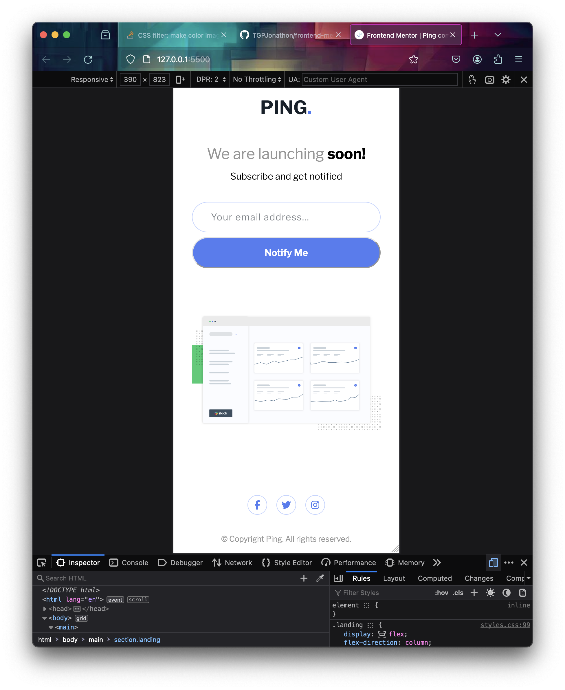

# Frontend Mentor - Ping coming soon page solution

This is a solution to the [Ping coming soon page challenge on Frontend Mentor](https://www.frontendmentor.io/challenges/ping-single-column-coming-soon-page-5cadd051fec04111f7b848da). Frontend Mentor challenges help you improve your coding skills by building realistic projects.

## Table of contents

- [Overview](#overview)
  - [Screenshot](#screenshot)
  - [Links](#links)
- [My process](#my-process)
  - [Built with](#built-with)
  - [What I learned](#what-i-learned)
  - [Continued development](#continued-development)

## Overview

Third challenge done after a two month break. I'm feeling very good about my developing CSS skills. I ran into two issues with this one. Styling the error only when something was entered, and working with svgs as images and not inline.

First problem got me reading about the css has selector which has worked great (except for in Firefox but that's okay).

Second problem was easily solved by using a div, but it took a while for my mind to get there after a lot of unhelpful googling.

### Screenshot

### Links

- Solution URL: [https://github.com/TGPJonathon/frontend-mentor-ping](https://github.com/TGPJonathon/frontend-mentor-ping)
- Live Site URL: [https://tgpjonathon.github.io/frontend-mentor-ping/](https://tgpjonathon.github.io/frontend-mentor-ping/)

## My process

### Built with

- Semantic HTML5 markup
- CSS custom properties
- Grid & Flex

### What I learned

I learned why display grid & place content: center were not working properly before. Setting the html and body height to 100%, and not having a wrapper for the content made things weird.

I also learned alot about pseudoelements and using the has selector which was very helpful.

### Continued development

I want to continue learning more about Flexbox & Grid & making accessible layouts.
